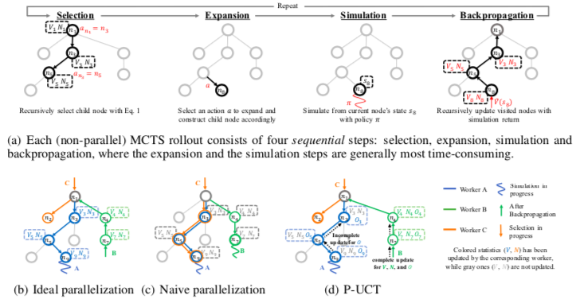
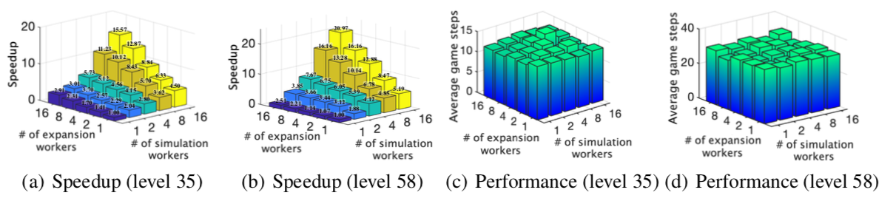
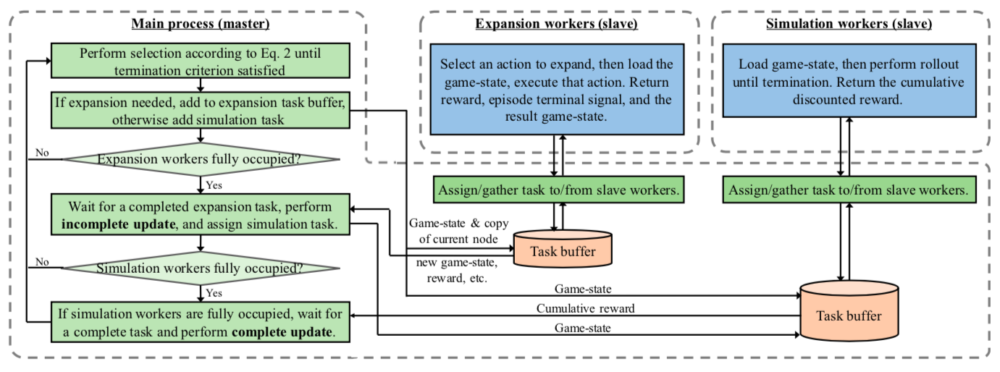
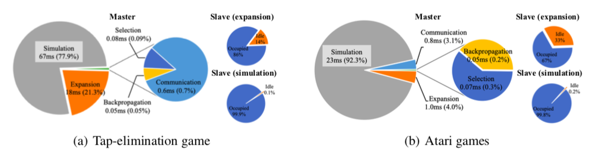

# WU-UCT (Watch the Unobserved in UCT)
A novel parallel UCT algorithm with linear speedup and negligible performance loss. This package provides a demo on Atari games (see [Running](#Running)). To allow easy extension to other environments, we wrote the code in an extendable way, and modification on only two files are needed for other environments (see [Run on your own environments](#Run-on-your-own-environments)).

This work has been accepted by **ICLR 2020** for **oral full presentation (48/2594)**.

# A quick demo!

This [Google Colaboratory link](https://colab.research.google.com/drive/140Ea6pd8abvg_HdZDVsCVfdeLICSa-f0) contains a demo on the PongNoFrameskip-v0 environment. We thank [@lvisdd](https://github.com/lvisdd) for building this useful demo!

# Introduction
Note: For full details of WU-UCT, please refer to our [Arxiv](https://arxiv.org/abs/1810.11755) or [OpenReview](https://openreview.net/forum?id=BJlQtJSKDB) paper.

## Conceptual idea
<p align="center">

</p>

We use the above figure to demonstrate the main problem caused by parallelizing UCT. (a) illustrates the four main steps of UCT: selection, expansion, simulation, and backpropagation. (b) a demonstration of the ideal (but unrealistic) parallel algorithm, i.e., the return V (cumulative reward) is available as soon as simulations start (in real-world cases they are observable only after simulations complete). (c) if we parallelize UCT naively, problems such as *collapes of exploration* or *exploitation failure* will happen. Specifically, since less statistics are available at the selection step, the algorithm cannot choose the "best" node to query. (d) we propose to keep track of the on-going but non-terminated simulations (called unobserved samples) to correct and compensate the outdated statistics. This allows performing principled selection step on parallel settings, allowing WU-UCT to achieve linear speedup as well as negligible performance loss.

<p align="center">

</p>

WU-UCT achieves ideal speedup under up to 16 workers, also without performance degradation.

<p align="center">

</p>

Clear advantage compared to baseline parallel approaches, in terms of both speed and accuracy.

## System implementation
<p align="center">

</p>

Our implementation of the system consists of a master process and two sets of slave workers, i.e., expansion workers and simulation workers. With a clear division of labor, we parallel the most time-consuming expansion and simulation step, while maintain the sequential structure in the selection and backpropagation step.

<p align="center">

</p>

The breakdown of time consumption (tested with 16 expansion and simulation workers) indicates we successfully parallelize the most time-consuming expansion and simulation process and maintains time-consumption of other steps relatively small.

# Usage
## Prerequisites
- Python 3.x
- PyTorch 1.0
- Gym (with atari) 0.14.0
- Numpy 1.17.2
- Scipy 1.3.1
- OpenCV-Python 4.1.1.26

## Running
1. Download or clone the repository.
2. Run with the default settings:
```
  python3 main.py --model WU-UCT
```
3. For additional hyperparameters please have a look at [main.py](https://github.com/liuanji/WU-UCT/tree/master/main.py) (they are also listed below), where descriptions are also included. For example, if you want to run the game PongNoFrameskip-v0 with 200 MCTS rollouts, simply run:
```
  python3 main.py --model WU-UCT --env-name PongNoFrameskip-v0 --MCTS-max-steps 200
```
or if you want to record the video of gameplay, run:
```
  python3 main.py --model WU-UCT --env-name PongNoFrameskip-v0 --record-video
```

* A full list of parameters
  * --model: MCTS model to use (currently support WU-UCT and UCT).
  * --env-name: name of the environment.
  * --MCTS-max-steps: number of simulation steps in the planning phase.
  * --MCTS-max-depth: maximum planning depth.
  * --MCTS-max-width: maximum width for each node.
  * --gamma: environment discount factor.
  * --expansion-worker-num: number of expansion workers.
  * --simulation-worker-num: number of simulation workers.
  * --seed: random seed for the environment.
  * --max-episode-length: a strict upper bound of environment's episode length.
  * --policy: default policy (see above).
  * --device: support "cpu", "cuda:x", and "cuda". If entered "cuda", it will use all available cuda devices. Usually used to load the policy.
  * --record-video: see above.
  * --mode: MCTS or Distill, see [Planning with prior policy](#Planning-with-prior-policy).

### Planning with prior policy
The code currently support three default policies (policy used to perform simulation): *Random*, *PPO*, *DistillPPO* (to use them, change the “--policy” parameter). To use the *PPO* and *DistillPPO* policy, corresponding policy files need to be put in [./Policy/PPO/PolicyFiles](https://github.com/liuanji/WU-UCT/tree/master/Policy/PPO/PolicyFiles). PPO policy files can be generated by [Atari_PPO_training](https://github.com/liuanji/WU-UCT/tree/master/Utils/Atari_PPO_training) (or see [Github](https://github.com/lnpalmer/PPO)). For example, by running
```
  cd Utils/Atari_PPO_training
  python3 main.py PongNoFrameskip-v0
```
a policy file will be generated in [./Utils/Atari_PPO_training/save](https://github.com/liuanji/WU-UCT/tree/master/Utils/Atari_PPO_training/save). To run DistillPPO, we have to run the distill training process by
```
  python3 main.py --mode Distill --env-name PongNoFrameskip-v0
```

## Run on your own environments
We kindly provide an [environment wrapper](https://github.com/liuanji/WU-UCT/tree/master/Env/EnvWrapper.py) and a [policy wrapper](https://github.com/liuanji/WU-UCT/tree/master/Policy/PolicyWrapper.py) to make easy extensions to other environments. All you need is to modify [./Env/EnvWrapper.py](https://github.com/liuanji/WU-UCT/tree/master/Env/EnvWrapper.py) and [./Policy/PolicyWrapper.py](https://github.com/liuanji/WU-UCT/tree/master/Policy/PolicyWrapper.py), and fit in your own environment. Please follow the below instructions.

1. Edit the class EnvWrapper in [./Env/EnvWrapper.py](https://github.com/liuanji/WU-UCT/tree/master/Env/EnvWrapper.py).

    Nest your environment into the wrapper by providing specific functionality in each of the member function of EnvWrapper. There are currently four input arguments to EnvWrapper: *env_name*, *max_episode_length*, *enable_record*, and *record_path*. If additional information needs to be imported, you may first consider adding them in *env_name*.

2. Edit the class PolicyWrapper in [./Policy/PolicyWrapper.py](https://github.com/liuanji/WU-UCT/tree/master/Policy/PolicyWrapper.py).

    Similarly, nest your default policy in PolicyWrapper, and pass the corresponding method using --policy. You will need to rewrite *get_action*, *get_value*, and *get_prior_prob* three member functions.

# Updates and to-dos
## Past updates
1. Refactor prior policy module to support easy reuse (Sep. 26, 2019).

## To-do list
(empty)

# Reference
Please cite the paper in the following format if you used this code during your research :)
```
@inproceedings{liu2020watch,
  title     = {Watch the Unobserved: A Simple Approach to Parallelizing Monte Carlo Tree Search},
  author    = {Anji Liu and Jianshu Chen and Mingze Yu and Yu Zhai and Xuewen Zhou and Ji Liu},
  booktitle = {International Conference on Learning Representations},
  month     = apr,
  year      = {2020},
  url       = "https://openreview.net/forum?id=BJlQtJSKDB"
}
```
